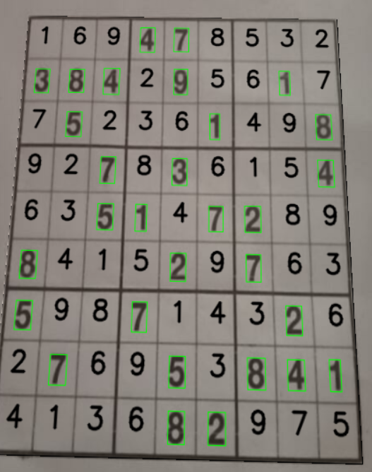

🎯 Real-Time Sudoku Solver

A Computer Vision and Deep Learning project that detects a Sudoku puzzle from a live webcam feed, recognizes digits using a CNN, solves the puzzle using backtracking, and overlays the solution back onto the physical board in real time.

✨ Features
Real-time Sudoku board detection
Perspective correction using homography
Grid line removal and digit extraction
CNN-based digit recognition
Custom fine-tuning for challenging Sudoku fonts
Temporal voting across multiple frames to reduce OCR noise
Sudoku validity checks before solving
Backtracking-based Sudoku solver
Augmented Reality overlay of solved digits

🛠️ Tech Stack
Python
OpenCV
TensorFlow / Keras
NumPy
Imutils

🔍 Pipeline
Webcam Feed
    ↓
Board Detection
    ↓
Perspective Transform
    ↓
Digit Segmentation
    ↓
CNN Recognition
    ↓
Temporal Voting
    ↓
Sudoku Validation
    ↓
Backtracking Solver
    ↓
AR Overlay

🚀 Highlights
Uses multiple geometric checks to ensure correct Sudoku detection.
Aggregates predictions from 15 consecutive frames using majority voting for robust digit recognition.
Fine-tuned the CNN with custom-generated Sudoku-style digits to improve accuracy on real-world puzzles.
Projects the solved puzzle back onto the original board using homography.

📸 Example

